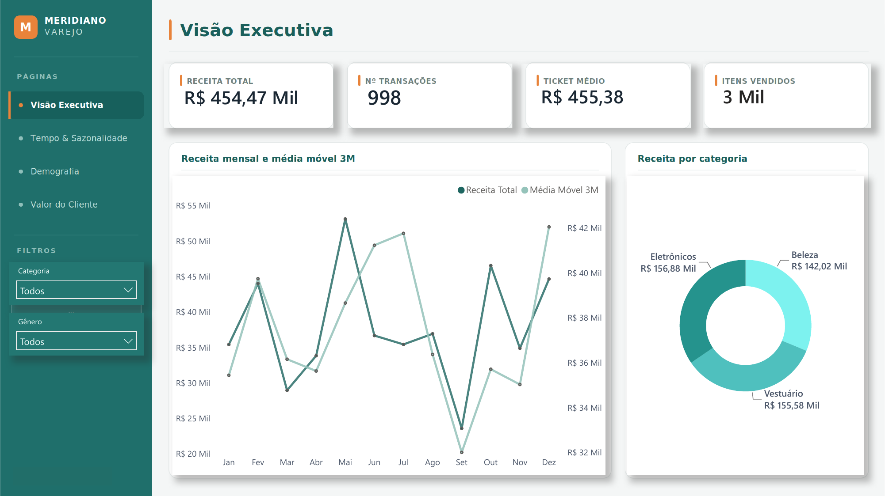
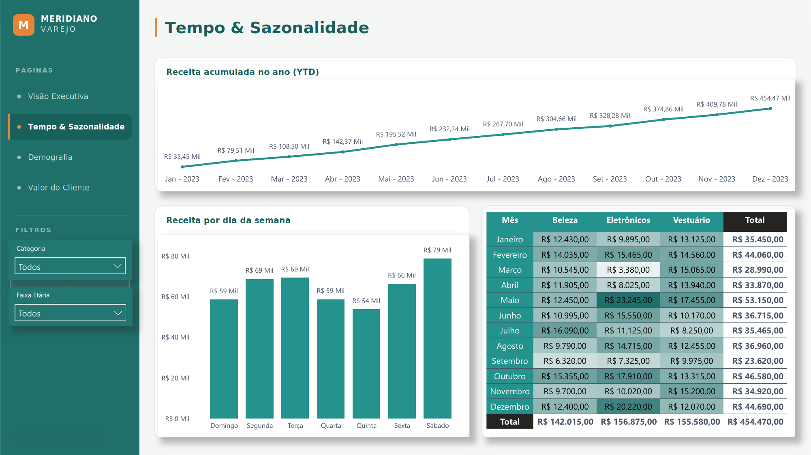
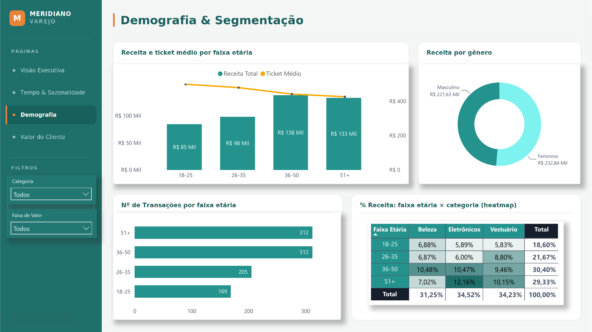
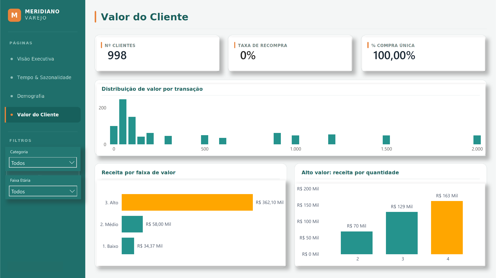

# Meridiano Varejo — Inteligência de Vendas 📊

> Dashboard executivo de vendas em **Power BI**, do dado bruto à narrativa de negócio: ETL reprodutível, modelo dimensional, camada DAX de _time intelligence_ e uma análise que testa hipóteses em vez de só descrever números.

**🔗 [Ver dashboard ao vivo](https://app.powerbi.com/view?r=eyJrIjoiMGZiYzBlNWItNzBlNi00OTVhLTk4ZDgtOGMxNDI0MmQwYzdmIiwidCI6ImU4MmU1OWEwLWY0YTAtNDNmMC1iM2E5LTIwMDZjNjdmMGQ2NiJ9)** · publicado no Power BI Service

---

## 🎥 Preview



| Tempo & Sazonalidade | Demografia & Segmentação | Valor do Cliente |
|:---:|:---:|:---:|
|  |  |  |

---

## Em uma frase

Recebi um _brief_ de um cliente (fictício) de varejo com um ano de dados de vendas parados numa planilha e nenhuma visibilidade para decidir. Transformei isso num dashboard executivo de 4 páginas, publicado, que responde cinco perguntas de negócio — e, no caminho, descobri que **80% da receita vem de 30% das transações, dirigidas por quantidade de itens** (e não por categoria ou perfil de cliente, como parecia).

## O que este projeto demonstra

- **ETL reprodutível** em Power Query (M), não célula digitada à mão
- **Modelagem dimensional** (star schema) com dimensão calendário e _time intelligence_
- **13 medidas DAX**, das básicas às de janela móvel com denominador dinâmico
- **Reconciliação Excel ↔ Power BI** como fonte única da verdade
- **Análise por eliminação** — testar e refutar hipóteses até isolar o driver real
- **Design executivo** consistente (tema + layout + paleta com cor semântica)

---

## 📚 Documentação detalhada

A história completa, do início ao fim, está em [`/docs`](docs/):

| # | Documento | O que cobre |
|---|---|---|
| 01 | [Contexto e escopo](docs/01-contexto.md) | O problema, o cliente fictício, as perguntas de negócio, as decisões de escopo |
| 02 | [Dados e profiling](docs/02-dados-e-profiling.md) | O dataset, o dicionário e os três achados que redefiniram o projeto |
| 03 | [ETL e modelagem](docs/03-etl-e-modelagem.md) | O pipeline em Power Query, a dimensão calendário e o star schema |
| 04 | [Medidas DAX](docs/04-medidas-dax.md) | As 13 medidas, com código e funcionalidade |
| 05 | [Páginas e análise](docs/05-paginas-e-analise.md) | As 4 páginas e os insights que se amarram |
| 06 | [Decisões e aprendizados](docs/06-decisoes-e-aprendizados.md) | As escolhas, as armadilhas e o que aprendi |

---

## 📁 Estrutura do repositório

```
meridiano-varejo-sales-analytics/
├── 01-documentacao/     brief do projeto, requisitos e dicionário de dados
├── 02-dados/            raw/ (CSV original) + processado/
├── 03-sql/              scripts de validação (trilha opcional)
├── 04-exploracao/       profiling / EDA
├── 05-modelo/           star schema + dimensão calendário
├── 06-powerbi/          arquivo .pbix
├── 07-entregaveis/      leitura executiva
├── excel-analise/       frente de Excel (Power Query, Power Pivot, validação)
├── docs/                documentação detalhada do projeto
└── assets/              screenshots do dashboard
```

---

## 🛠️ Stack

**Excel** (Power Query, Power Pivot, DAX) · **Power BI** (Desktop + Service) · **SQL** (trilha opcional).

Excel e Power BI foram ferramentas co-principais: como o Power Query e o Power Pivot usam as mesmas engines do Power BI, o modelo foi **ensaiado no Excel antes de migrar** — menos erro, mais domínio da lógica.

---

## 📌 Sobre

Projeto de portfólio em Análise de Dados, com foco em fundamentos bem executados e **narrativa de negócio** acima de sofisticação técnica desnecessária.
_Cliente fictício, criado para simular um contexto real. O dado é público (Kaggle)._

**Autor:** Lucas Fontes · 🔗 [GitHub](https://github.com/Lucasfontez) · [LinkedIn](https://www.linkedin.com/in/lucassfontesc/)
